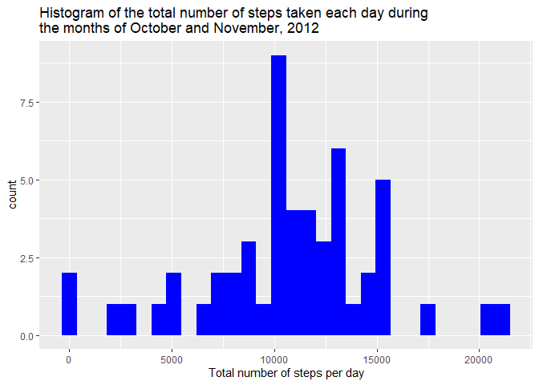

Loading and preprocessing the data
----------------------------------

Data is downloaded from the course website [Activity Monitoring
Data](https://d396qusza40orc.cloudfront.net/repdata%2Fdata%2Factivity.zip)
into the working directory. This data is generated from a personal
activity monitoring device. This device collects data at 5 minute
intervals through out the day. The data consists of two months of data
from an anonymous individual collected during the months of October and
November, 2012 and include the number of steps taken in 5 minute
intervals each day.  
The variables included in this dataset are:

-   steps: Number of steps taking in a 5-minute interval (missing values
    are coded as “NA”)  
-   date: The date on which the measurement was taken in “YYYY-MM-DD”
    format  
-   interval: Identifier for the 5-minute interval in which measurement
    was taken

``` r
WD <- getwd()
download.file(url = "https://d396qusza40orc.cloudfront.net/repdata%2Fdata%2Factivity.zip",
destfile = paste(WD, "ProjectFiles.zip", sep = "/"))
unzip(zipfile = "ProjectFiles.zip")
```

Once the file “activity.csv” is unzipped in the current working
directory, We:

1.  read it using the “read.scv()” function in R.  
2.  transform the date and interval columns to the correct formats.  
3.  show the summary of the resulting data

``` r
activity <- read.csv("activity.csv", sep=",")
# str(activity)
activity$interval=as.factor(activity$interval)
activity$date=as.Date(activity$date,format="%Y-%m-%d")
# str(activity)
summary(activity)
```

    ##      steps             date               interval    
    ##  Min.   :  0.00   Min.   :2012-10-01   0      :   61  
    ##  1st Qu.:  0.00   1st Qu.:2012-10-16   5      :   61  
    ##  Median :  0.00   Median :2012-10-31   10     :   61  
    ##  Mean   : 37.38   Mean   :2012-10-31   15     :   61  
    ##  3rd Qu.: 12.00   3rd Qu.:2012-11-15   20     :   61  
    ##  Max.   :806.00   Max.   :2012-11-30   25     :   61  
    ##  NA's   :2304                          (Other):17202

What is mean total number of steps taken per day?
-------------------------------------------------

For this part of the assignment, we ignore the missing values in the
dataset.

1.  Let’s make a histogram of the total number of steps taken each day.
    At first, we calculate the total number of steps taken each day.

``` r
library(dplyr)
```

``` r
totalstepsperday<- activity %>% group_by(date) %>% summarise(total.steps=sum(steps))
head(totalstepsperday)    
```

    ## # A tibble: 6 x 2
    ##   date       total.steps
    ##   <date>           <int>
    ## 1 2012-10-01          NA
    ## 2 2012-10-02         126
    ## 3 2012-10-03       11352
    ## 4 2012-10-04       12116
    ## 5 2012-10-05       13294
    ## 6 2012-10-06       15420

Then, we plot the histogram:

``` r
library(ggplot2)
```

``` r
g<-ggplot(data=totalstepsperday,aes(x=total.steps))
g1 <- g+
    geom_histogram(fill='blue', bins=30)+
    labs(title="Histogram of the total number of steps taken each day during 
the months of October and November, 2012",
         x="Total number of steps per day" )
print(g1)
```

    ## Warning: Removed 8 rows containing non-finite values (stat_bin).



1.  Here, we calculate and report the **mean** and **median** total
    number of steps taken per day.

``` r
totalstepsperday_summary <- totalstepsperday %>%
    summarize(total.steps.mean=mean(total.steps,na.rm=TRUE),
    total.steps.median=median(total.steps,na.rm = TRUE))
data_summary <- as.data.frame(t(totalstepsperday_summary))
colnames(data_summary) <- "value"
data_summary
```

    ##                       value
    ## total.steps.mean   10766.19
    ## total.steps.median 10765.00

What is the average daily activity pattern?
-------------------------------------------

In the following, we show a time series plot of the 5-minute interval
(x-axis) and the average number of steps taken, averaged across all days
of October and November, 2012 (y-axis). We proceed in 3 steps:

-   Steps1: we calculate the average number of steps taken, averaged
    across all days, per 5-minute interval.

``` r
activityperinterval <- activity %>% 
    group_by(interval) %>% 
    summarize(average.steps.number=mean(steps,na.rm=TRUE))
head(activityperinterval)
```

    ## # A tibble: 6 x 2
    ##   interval average.steps.number
    ##   <fct>                   <dbl>
    ## 1 0                      1.72  
    ## 2 5                      0.340 
    ## 3 10                     0.132 
    ## 4 15                     0.151 
    ## 5 20                     0.0755
    ## 6 25                     2.09

-   Steps2: we extract the 5-minute interval which, on average across
    all the days in the dataset, contains the maximum number of steps.

``` r
max.position <- which.max(activityperinterval$average.steps.number)
max.interval <- as.numeric(as.character(activityperinterval$interval[max.position]))
max.interval.value <- activityperinterval$average.steps.number [max.position]
max.range.interval <- max(as.numeric(as.character(activityperinterval$interval)))
paste0("The 5-minute interval that contains, on average across all the days in the dataset, the maximum number of steps is the ",
       max.interval," 5-minute interval")
```

    ## [1] "The 5-minute interval that contains, on average across all the days in the dataset, the maximum number of steps is the 835 5-minute interval"

-   Steps3: we display the corresponding plot.

``` r
g2 <- ggplot(data=activityperinterval, aes(x=as.numeric(as.character(interval)),y=average.steps.number))+
    geom_line(color="blue") +
    geom_vline(xintercept=max.interval,linetype=2, color="red") +
    scale_x_continuous(breaks=c(seq(0,max.range.interval, by = 250),max.interval))+
    theme(axis.text.x = element_text(angle = 90, vjust = 0.5,hjust=1,size=9,face="bold"))+
    labs(title="Time series plot of the 5-minute interval (x-axis) and the average number of steps \n taken, averaged across all days of October and November, 2012 (y-axis)", 
         x="5-minute intervals",
         y= "average number of steps across all the days" )
  
g2
```


Imputing missing values
-----------------------

There are a number of days/intervals where there are missing values
(coded as “NA”). The presence of missing days may introduce bias into
some calculations or summaries of the data.  
In the following, we calculate and report the total number of missing
values in the dataset (i.e. the total number of rows with NAs).

``` r
colSums(is.na(activity))
```

    ##    steps     date interval 
    ##     2304        0        0

we can look at days concerned with missing values:

``` r
data.na <- activity[which(is.na(activity$steps)),]
table(data.na$date)
```

    ## 
    ## 2012-10-01 2012-10-08 2012-11-01 2012-11-04 2012-11-09 2012-11-10 2012-11-14 
    ##        288        288        288        288        288        288        288 
    ## 2012-11-30 
    ##        288

There are 8 missing days, where all intervals are missing (since the
number of intervals per day is 288)

``` r
length(unique(activity$interval))
```

    ## [1] 288

we can make a plot of the activity data to see if we can figure out a
pattern that can guide us to impute missing data.

``` r
ggplot(activity, aes(x = interval, y =date , color = steps)) + 
    geom_point(show.legend = TRUE, alpha=0.5) +
    labs(x = 'intervals', y='days',  title = "number of steps per day and per interval",
         color = 'steps') + 
    scale_x_discrete(breaks=c(seq(0, 2250, by = 250)))+
    scale_color_gradient(low = "green", high = "red",
                         na.value = "blue", guide = "legend") +
        theme(legend.position="bottom")
```


Based on the plot, we do not see a clear pattern that could guide us on
imputing missing data. A simple way, is to impute missing data of each
5-minute interval by the median or the mean of that 5-minute interval.
we will use the median.

``` r
activity.imputed <- activity %>%
    group_by(interval) %>%
    mutate(steps = replace(steps,is.na(steps), median(steps, na.rm = TRUE)))
head(activity.imputed)
```

    ## # A tibble: 6 x 3
    ## # Groups:   interval [6]
    ##   steps date       interval
    ##   <int> <date>     <fct>   
    ## 1     0 2012-10-01 0       
    ## 2     0 2012-10-01 5       
    ## 3     0 2012-10-01 10      
    ## 4     0 2012-10-01 15      
    ## 5     0 2012-10-01 20      
    ## 6     0 2012-10-01 25

Now we can make a histogram of the total number of steps taken each day
and Calculate and report the mean and median total number of steps taken
per day (as done before).

``` r
totalstepsperday.imputed<- activity.imputed %>% group_by(date) %>% summarise(total.steps=sum(steps))
head(totalstepsperday.imputed)    
```

    ## # A tibble: 6 x 2
    ##   date       total.steps
    ##   <date>           <int>
    ## 1 2012-10-01        1141
    ## 2 2012-10-02         126
    ## 3 2012-10-03       11352
    ## 4 2012-10-04       12116
    ## 5 2012-10-05       13294
    ## 6 2012-10-06       15420

``` r
g0<-ggplot(data=totalstepsperday.imputed,aes(x=total.steps))
g01 <- g0+
    geom_histogram(fill='blue', bins=30)+
    labs(title="Histogram of the total number of steps taken each day during 
the months of October and November, 2012",
         x="Total number of steps per day" )
print(g01)
```


``` r
totalstepsperday_summary_imputed <- totalstepsperday.imputed %>%
    summarize(total.steps.mean=mean(total.steps,na.rm=TRUE),
    total.steps.median=median(total.steps,na.rm = TRUE))
data_summary_imputed <- as.data.frame(t(totalstepsperday_summary_imputed))
colnames(data_summary_imputed) <- "value"
data_summary_imputed
```

    ##                        value
    ## total.steps.mean    9503.869
    ## total.steps.median 10395.000

These values differ from the estimates from the first part of the
assignment. Imputing missing data has decreased the mean and median
estimates of the total daily number of steps.

Are there differences in activity patterns between weekdays and weekends?
-------------------------------------------------------------------------

In the following, we will create a new factor variable in the dataset
with two levels – “weekday” and “weekend” indicating whether a given
date is a weekday or weekend day.

``` r
library(lubridate) # to use wday() function
Sys.setlocale("LC_TIME", "English") # to set days labels in english
```

    ## [1] "English_United States.1252"

``` r
activity.imputed2 <- activity.imputed  %>%
        mutate(day = wday(date,label=TRUE), 
               day.nature=factor(1*(day %in% c("Sun","Sat")),labels=c("weekday","weekend")))
table(activity.imputed2$day.nature, activity.imputed2$day)
```

    ##          
    ##            Sun  Mon  Tue  Wed  Thu  Fri  Sat
    ##   weekday    0 2592 2592 2592 2592 2592    0
    ##   weekend 2304    0    0    0    0    0 2304

Now , we can make a panel plot containing a time series plot of the
5-minute interval (x-axis) and the average number of steps taken,
averaged across all weekday days or weekend days (y-axis).

``` r
activityperinterval.w <- activity.imputed2 %>% 
    group_by(interval,day.nature) %>% 
    summarize(average.steps.number=mean(steps,na.rm=TRUE))
head(activityperinterval.w)
```

    ## # A tibble: 6 x 3
    ## # Groups:   interval [3]
    ##   interval day.nature average.steps.number
    ##   <fct>    <fct>                     <dbl>
    ## 1 0        weekday                   2.02 
    ## 2 0        weekend                   0    
    ## 3 5        weekday                   0.4  
    ## 4 5        weekend                   0    
    ## 5 10       weekday                   0.156
    ## 6 10       weekend                   0

``` r
g02<- ggplot(data=activityperinterval.w, aes(x=as.numeric(as.character(interval)),y=average.steps.number))+
    geom_line(color="blue") +
    scale_x_continuous(breaks=seq(0,max.range.interval, by = 250))+
    theme(axis.text.x = element_text(angle = 90, vjust = 0.5,hjust=1,size=9,face="bold"))+
    labs(title="Time series plot of the 5-minute interval (x-axis) and the average number of steps \n taken, averaged across all days of October and November, 2012 (y-axis)", 
         x="5-minute intervals",
         y= "average number of steps across all the days" )+
    facet_grid(day.nature~.)
g02
```


